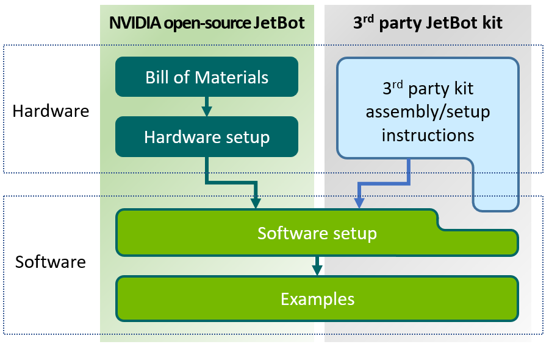

# Getting Started

## Step 1 - Pick your vehicle!

To get started with JetBot, first pick your vehicle (hardware) you want to make.

For details of NVIDIA-designed open-source JetBot hardware, check [Bill of Materials](bill_of_materials.md) page and [Hardware Setup](hardware_setup.md) page.

To find kits available from third parties, check [Third Party Kits](third_party_kits.md) page.

## Step 2 - Setup your JetBot

After you've decided which vehicle you want to build, you'll need to source the parts and follow the setup instructions. After that, you're ready to move on to the JetBot examples!

### Option 1 - DIY JetBot Kit

To get started with the DIY open-source JetBot, follow these steps.

1. Get the parts from the [bill of materials](bill_of_materials.md).

2. Follow the [hardware setup](hardware_setup.md)

3. Follow the [software setup](software_setup/docker.md)

### Option 2 - Third Party JetBot Kit

Third party JetBot kits may have different setup instructions from the DIY JetBot. To get started with a third party jetbot, we recommend referring to the third party kit's setup instructions for details on how to setup.

Check out the [Third Party Kits](third_party_kits.md) page for links and information related to third party kits.

## Step 3 - Follow the examples

JetBot comes with many examples to teach robotics and AI basics. These give you the experience you need to begin exploring your own applications with JetBot.

### Example 1 - Basic Motion

The [Basic Motion](examples/basic_motion.md) example teaches you how to program JetBot from your web browser with basic motor controls.

### Example 2 - Teleoperation

The [Teleoperation](examples/teleoperation.md) example teaches you how to stream live images from JetBot and control JetBot with a gamepad attached to your laptop.

### Example 3 - Collision Avoidance

The [Collision Avoidance](examples/collision_avoidance.md) example teaches you how to collect data and train a custom Image Classification model to enable JetBot to avoid collisions in a variety of scenarios. The method learned here can be extended to recognize arbitrary classes of image, which can be extended far beyond JetBot!

### Example 4 - Road Following

The [Road Following](examples/road_following.md) example teaches you how to collect data and train a custom Image Regression model to enable JetBot to follow a road. The method learned here can be extended to detect an arbitrary x, y coordinate in an image, which extends far beyond JetBot!

### Example 5 - Object Following

The [Object Following](examples/object_following.md) teaches you how to use a pre-trained object detection model for following an object, like a person, cup, or dog. The pre-trained network you'll learn to use here can be used for a variety of new AI projects.

## And more!

Take the examples, modify them, make JetBot do something new, or create an entirely new AI project of your own.  

If you do something cool with JetBot, [let us know!](https://forums.developer.nvidia.com/c/agx-autonomous-machines/jetson-embedded-systems/jetson-projects)

Happy JetBotting :)
